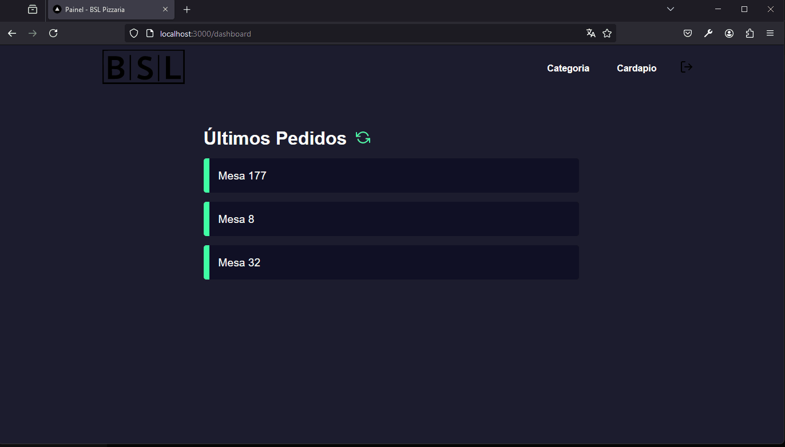

# Sitema de Pizzaria - NextJs

### Tópicos 

* [Sobre](#Sobre)

* [Funcionalidades](#funcionalidades)

* [Funcionalidades futuras](#funcionalidades-futuras)

* [Desenvolvido por:](#desenvolvido-por)

## Sobre:
Bem vindo ao front-end da nossa aplicação, esse projeto trata-se de um sistema de atendimento para estabelecimentos de atendimento ao público como lanchonetes, restaurantes e  afins, nesse projeto utilizei uma pizzaria.

O porjeto está divido em outros 2 repositórios:
 
[Back-end](https://github.com/bruno-lima1504/nodejs-prisma-postgresql-pizzaria)
 
[Mobile](https://github.com/bruno-lima1504/reactnative-ts-mobile-pizzaria)

O back-end foi executado com NodeJS e PostgreSQL, e o mobile executado em React-Native,  para mais detalhes acesse os repósitórios.

Essa etapa do projeto visa receber os pedidos realizados pelo aplicativo no salão de atendimento  diretamenta na cozinha, facilitando a rotina dos atendentes já que não terão necessidade ir até o local para entregar o pedido. Também facilita a organização de ordem de pedidos em vista via em papel feita manualmente na maioria dos estabelecimentos.

## Funcionalidades:
O projeto conta coma as bibliotecas:

    - axios
    - jwt-decote
    - react-modal
    - react-toastify
    - sass    

Criação de usuários, login, criação e edição de novas categorias de produtos, criação e edição de produtos, listagem dos produtos abertos no aplicativo para serem executados na cozinha e finalização do pedido.

As descrições mais detalhadas de cada componente do sistema esta a seguir.

### Cadastro

 
A tela de cadastro de usuário conta com os campos de nome, e-mail e senha, verificação de preenchimento e de informações dos campos, também conta alertas personalizados para sucesso ou erro no cadastro.

 
 

### Acesso

 
A tela de login de usuário conta com os campos de e-mail e senha, verificação de preenchimento e de informações dos campos, também conta alertas personalizados para sucesso ou erro no cadastro, apenas usuários cadastrados conseguem acessar a home do sistema.

####  Logando

 
 

### Dashboard

Aqui fica nossa home, exibindo os pedidos que foram realizados e ainda não foram preparados pela cozinha, tambémnos permite acesso a outras funcionalidades do sistema.

 

 
 

### Categoria

 
Essa página é o local onde podemos adicionarum nova categoria de produto, a categoria serve como um primeiro filtro para escolhermos os produtos que serão adicionados ao pedido.
 

#### Adicionando categoria

 
 

### Produtos

 
Aqui podemos criar novos produtos que serão adicionados ao cardápio da pizzaria, também é nessa página que é definida a categoria ao qual o produto pertence.

#### Adicionando produto

 
 

### Finalizando Pedido

 
Após o preparo do pedido é aqui onde a cozinha pode finalizar o pedido.

 
 

## Funcionalidades Futuras:

O projeto foi estruturado para que seja totalmente expansível e escalável, as próximas atuializações pretendo adicionar:
- Envio de notificação para o garçom.
- Caixa de atendimento

## Desenvolvido por:

| [ Bruno Lima](https://github.com/bruno-lima1504) 
| :---: |

